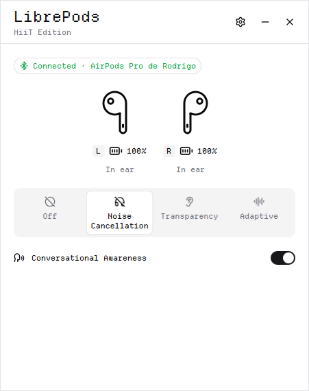
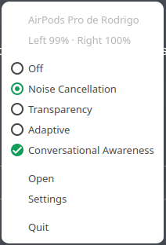
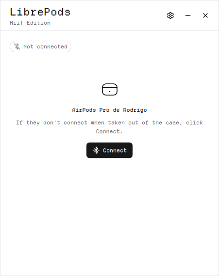
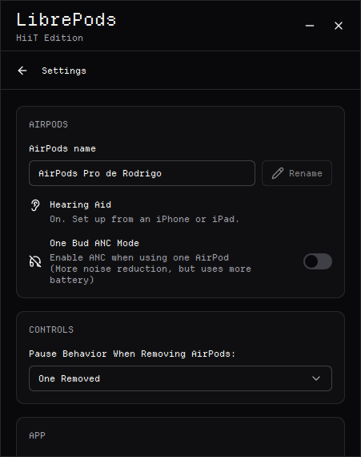

# LibrePods HiiT Edition

Control your AirPods on Linux: noise control modes, battery, ear detection and
Conversational Awareness, from a small window and the system tray.

> [!NOTE]
> This is an **unofficial fork** of [LibrePods](https://github.com/librepods-org/librepods),
> focused on the Linux app's usability and look. It is not affiliated with or endorsed by
> the LibrePods project or by Apple Inc. For the Android app and the protocol work, see
> the upstream project.

<p align="center">
  <picture>
    <source media="(prefers-color-scheme: dark)" srcset="imgs/hiit/connected-dark.png" />
    
  </picture>
</p>

## Download

Get `LibrePods-HiiT-x86_64.AppImage` from the
[latest release](https://github.com/rHiiT/librepods-hiit/releases/latest), then:

```bash
chmod +x LibrePods-HiiT-x86_64.AppImage
./LibrePods-HiiT-x86_64.AppImage
```

On first run the app adds itself to your application menu. To start it with your
session, turn on **Settings > App > Auto-Start on Login**.

Builds of the latest `main` are available as artifacts of the
[Linux workflow](https://github.com/rHiiT/librepods-hiit/actions/workflows/ci-linux.yml).

**Requirements:** x86_64, glibc 2.35 or newer (Ubuntu 22.04, Debian 12, Fedora 36 and
later), BlueZ, and PipeWire (with `pipewire-pulse`) or PulseAudio.

## What this fork changes

- **Tray first.** The tray menu shows the AirPods name, battery of each bud and the case,
  and the connection state, with **Connect** when they are paired but not connected.
  Noise modes and Conversational Awareness only show what the AirPods confirmed.
- **Clear connection states.** Bluetooth off, not paired, paired, connecting and failed each
  get their own message and action, including a step-by-step guide to pair.
- **Low battery warning:** a red dot on the tray icon and one notification at 20%.
- **Pause when one bud is removed** now works on PipeWire, and sound comes back after
  reconnecting (the audio profile no longer stays on "off").
- **Case battery** out of reach is shown as the last reading, not as a live level.
- **New interface:** Departure Mono font, Lucide icons, original illustrations, light,
  dark or system theme, fixed-size frameless window.
- **Languages:** English, Brazilian Portuguese, Italian and Turkish.
- **Window lives in the tray:** minimize and close send it to the tray (optional); on KDE
  Plasma it also stays out of the taskbar.

The full list, required by the GPL, is in [CHANGES-HIIT.md](CHANGES-HIIT.md).

<table>
  <tr>
    <th>Tray menu</th>
    <th>Not connected</th>
    <th>Settings</th>
  </tr>
  <tr>
    <td valign="top"></td>
    <td valign="top">
      <picture>
        <source media="(prefers-color-scheme: dark)" srcset="imgs/hiit/paired-dark.png" />
        
      </picture>
    </td>
    <td valign="top"></td>
  </tr>
</table>

## Desktop support

Developed and tested on **KDE Plasma 6 (Wayland)**. Other desktops are expected to work
with the differences below.

| | KDE Plasma | GNOME | XFCE, Cinnamon, MATE | Sway, Hyprland |
|---|---|---|---|---|
| Tray icon and menu | ✅ | With the [AppIndicator extension](https://extensions.gnome.org/extension/615/appindicator-support/) | ✅ | Depends on the bar |
| Notifications | ✅ | ✅ | ✅ | Needs a notification daemon |
| Window out of the taskbar | ✅ | — | — | — |
| "Bluetooth settings" button | ✅ | ✅ | With Blueman | — |

Without a tray the window minimizes and closes like any other app, so it is always
reachable; opening the app again from the menu brings the window back.

## Build from source

Qt 6 (tested with 6.8 and 6.10), OpenSSL and libpulse. On Debian or Ubuntu:

```bash
sudo apt install build-essential cmake ninja-build qt6-base-dev qt6-declarative-dev \
  qt6-svg-dev qt6-tools-dev qt6-connectivity-dev libssl-dev libpulse-dev
cd linux
cmake -B build -G Ninja && cmake --build build
cmake --install build --prefix ~/.local
```

To build the AppImage: `linux/packaging/build-appimage.sh` (set `QMAKE` to choose the Qt).

## License and credits

GPL-3.0, like LibrePods (Copyright (C) 2025 LibrePods contributors). See [LICENSE](LICENSE)
and the list of changes in [CHANGES-HIIT.md](CHANGES-HIIT.md).

- [LibrePods](https://github.com/librepods-org/librepods) and its contributors, for the
  app this fork builds on and the AirPods protocol work.
- [Departure Mono](https://departuremono.com) by Helena Zhang, SIL Open Font License 1.1.
- [Lucide](https://lucide.dev) icons, ISC License.

AirPods and AirPods Pro are trademarks of Apple Inc. The LibrePods name belongs to the
LibrePods project; this fork is not affiliated with it or with Apple.
